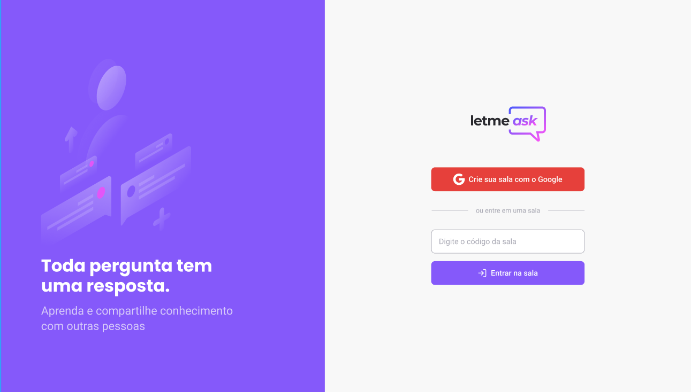
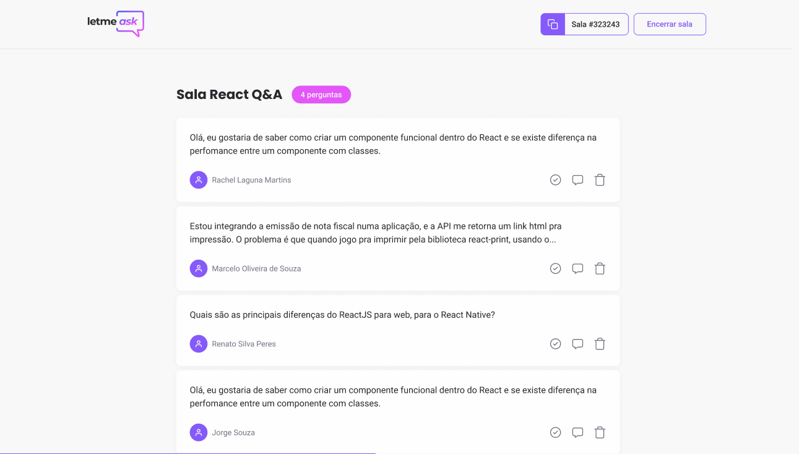

<h1>Letmeask</h1>

<p>
	
   	<a href="https://github.com/facebook/react">
    	
  	</a>
	  <a href="https://github.com/microsoft/TypeScript">
    	
  	</a>
   <a href="https://opensource.org/licenses/MIT">
    
  </a>
</p>

<br>
<br>
<br>
<br>

<p align="center" >
	
</p>

<br>
<br>
<br>
<br>

<h2 align="center" style="font: 700 28px Roboto, sans-serif;">Sobre o Letmeask</span></h2>

<p style='text-align: justify; font: 400 18px Roboto, sans-serif; line-height: 30px'>Uma aplicação criada para facilitar a visualização e gerenciamento de um grande fluxo de perguntas entre uma figura central e aqueles que desejam esclarecer suas dúvidas. 
Para utilizar o serviço, os usuário necessitam ter uma conta no google (gmail).</p>

<br>

<br>

<p align="center">
  
</p>

<p align="center">
  
</p>

<br>

<strong style="font: 700 26px Roboto, sans-serif;">Instalação</strong>

```bash
# Abra 0 terminal e copie o repositório com o comando
git clone https://github.com/PedroTrogo/Letmeask-nlw6.git
# ou use a opção de download.

# Entre na pasta do projeto com 
cd letmeask

# Instale as dependências
yarn / npm install

# Rode a aplicação
yarn start / npm start

# Acesse http://localhost:3000 no seu navegador.
```

<br>


<strong style="font: 700 26px Roboto, sans-serif;">Licença</strong>
<a href="https://opensource.org/licenses/MIT">
    
</a>

<br>

Esse projeto está sob a licença MIT. Veja o arquivo [LICENSE](https://github.com/PedroTrogo/Letmeask-nlw6/blob/main/LICENSE) para mais detalhes.

---
Projeto criado durante a sexta edição do next-level-week da rocketseat.
<br>
by [Pedro Trogo](https://github.com/PedroTrogo) :rocket: 

<br>
<br>
<br>
